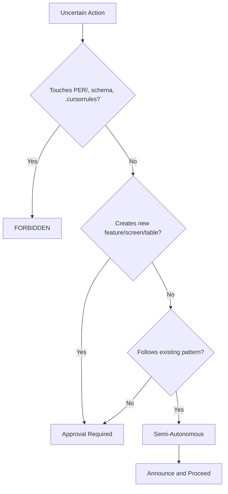

# Agent Autonomy Boundaries

**Purpose:** Define clear decision matrices for when AI agents can act independently vs. when user approval is required.

**Last Updated:** 2025-01-23

---

## The Autonomy Spectrum

```
FORBIDDEN ◄──────────────────────────────────────────────► AUTONOMOUS
    │                                                            │
    │  User Approval    Semi-Autonomous    Announce &           │
    │    Required         (Confirm)         Proceed             │
    └────────────────────────────────────────────────────────────┘
```

---

## Level 1: Autonomous (No Approval Needed)

**These actions can be taken immediately without user confirmation.**

### Read Operations
| Action | Example |
|--------|---------|
| Reading any file | `Read specs/03-frontend/DESIGN_SYSTEM.md` |
| Searching codebase | `Grep "function handleSubmit"` |
| Listing files | `Glob "**/*.tsx"` |
| Checking git status | `git status`, `git log` |
| Reading documentation | Any `.md` file |

### Build & Test Operations
| Action | Example |
|--------|---------|
| Running builds | `swift build`, `npm run build` |
| Running tests | `npm test`, `swift test` |
| Running linters | `eslint .`, `prettier --check` |
| Type checking | `tsc --noEmit` |
| Checking dependencies | `npm audit`, `npm outdated` |

### Planning Operations
| Action | Example |
|--------|---------|
| Creating execution plans | Drafting implementation steps |
| Analyzing code | Identifying patterns, issues |
| Generating Mermaid diagrams | Visual documentation |
| Proposing file structures | Suggesting organization |
| Estimating scope | Identifying affected files |

---

## Level 2: Semi-Autonomous (Announce and Proceed)

**Announce intent, then proceed unless user objects.**

### File Creation (Within Defined Structure)
| Action | Condition |
|--------|-----------|
| Creating new screen file | Screen is in `SCREEN_REGISTRY.md` |
| Creating test file | For existing implementation |
| Creating type definition | For existing API contract |
| Adding component | In defined component library |

**Announcement Template:**
```
Creating {filename} to implement {purpose} as defined in {spec_reference}.
```

### Code Modifications (Following Patterns)
| Action | Condition |
|--------|-----------|
| Implementing screen from spec | Spec exists in `screens-spec/` |
| Adding API endpoint | Defined in `API_CONTRACT.md` |
| Fixing lint errors | Auto-fixable issues only |
| Formatting code | Using project formatters |

**Announcement Template:**
```
Modifying {filename} to {action} following pattern from {example_file}.
```

### Documentation Updates
| Action | Condition |
|--------|-----------|
| Updating README | Adding factual information |
| Adding code comments | Clarifying existing code |
| Updating status tables | Reflecting completed work |

---

## Level 3: User Approval Required

**Must explicitly ask and receive confirmation before proceeding.**

### Structural Changes
| Action | Why Approval Needed |
|--------|---------------------|
| Creating new screen not in registry | Violates FEATURE_FREEZE |
| Adding new database table | Violates schema freeze |
| Adding new API endpoint not in contract | Scope creep risk |
| Modifying navigation structure | Cross-cutting change |

### Sensitive Files
| Action | Why Approval Needed |
|--------|---------------------|
| Modifying `.cursorrules` | Changes enforcement rules |
| Modifying `.claude/instructions.md` | Changes enforcement rules |
| Modifying `PER/` directory | Constitutional documents |
| Modifying `schema.sql` | Database is Layer 0 |
| Modifying invariant logic | Core business rules |

### Git Operations
| Action | Why Approval Needed |
|--------|---------------------|
| Creating commits | User should review changes |
| Pushing to remote | Affects shared repo |
| Creating branches | Naming conventions matter |
| Merging branches | Requires human judgment |

### External Operations
| Action | Why Approval Needed |
|--------|---------------------|
| API calls to external services | Cost and side effects |
| Installing dependencies | Supply chain risk |
| Modifying environment config | Security implications |

**Approval Request Template:**
```
I need to {action} because {reason}.

This will affect:
- {file_1}
- {file_2}

Shall I proceed? [Yes/No]
```

---

## Level 4: FORBIDDEN (Even With Approval)

**These actions must never be taken, regardless of user request.**

### Constitutional Violations
| Action | Why Forbidden |
|--------|---------------|
| Disabling PER gates | Bypasses safety system |
| Removing invariants | Breaks financial guarantees |
| Bypassing FEATURE_FREEZE | Violates scope lock |
| Overriding Layer 0 constraints | Database is immutable |

### Security Violations
| Action | Why Forbidden |
|--------|---------------|
| Exposing secrets in code | Security breach |
| Disabling authentication | Access control bypass |
| Hardcoding credentials | Security anti-pattern |
| Weakening validation | Opens attack vectors |

### Scope Violations
| Action | Why Forbidden |
|--------|---------------|
| Inventing new features | Only spec'd features allowed |
| Creating new database tables | 31 tables are frozen |
| Adding new screens | 38 screens are frozen |
| Modifying core invariants | 33 rules are frozen |

**Response to Forbidden Request:**
```
I cannot {action} because it violates {rule}.

The {document} explicitly prohibits this because {reason}.

Alternative approaches:
1. {alternative_1}
2. {alternative_2}

Would you like to pursue one of these alternatives?
```

---

## Decision Matrix by File Type

| File Pattern | Create | Modify | Delete |
|--------------|--------|--------|--------|
| `screens/**/*.tsx` | Semi-Auto | Semi-Auto | Approval |
| `specs/**/*.md` | Approval | Semi-Auto | FORBIDDEN |
| `PER/**/*` | FORBIDDEN | FORBIDDEN | FORBIDDEN |
| `.cursorrules` | FORBIDDEN | Approval | FORBIDDEN |
| `schema.sql` | FORBIDDEN | Approval | FORBIDDEN |
| `ios-swiftui/**/*.swift` | Semi-Auto | Semi-Auto | Approval |
| `tests/**/*` | Autonomous | Autonomous | Approval |
| `*.md` (docs) | Autonomous | Autonomous | Approval |

---

## Decision Matrix by Operation Type

| Operation | Frontend | Backend | iOS | Database |
|-----------|----------|---------|-----|----------|
| Read | Autonomous | Autonomous | Autonomous | Autonomous |
| Create (in spec) | Semi-Auto | Approval | Semi-Auto | FORBIDDEN |
| Create (not in spec) | Approval | Approval | Approval | FORBIDDEN |
| Modify (following pattern) | Semi-Auto | Semi-Auto | Semi-Auto | Approval |
| Modify (new pattern) | Approval | Approval | Approval | FORBIDDEN |
| Delete | Approval | Approval | Approval | FORBIDDEN |

---

## Escalation Protocol

When uncertain about autonomy level:

```
1. Check if action touches FORBIDDEN files → STOP
2. Check if action is in FORBIDDEN list → STOP
3. Check if file/action requires approval → ASK USER
4. Check if can announce and proceed → ANNOUNCE
5. Otherwise → AUTONOMOUS
```

### Uncertainty Resolution



---

## Self-Check Questions

Before any action, ask:

1. **Is this in scope?** (Check `FINISHED_STATE.md`)
2. **Does the file exist?** (Check `PER-1_EXISTENCE_GATE.md`)
3. **Is there a spec?** (Check `screens-spec/` or `specs/`)
4. **What layer does this touch?** (Check authority hierarchy)
5. **Could this break invariants?** (Check `PER/INVARIANTS.md`)

If any answer is uncertain → Escalate to User Approval.

---

## Cross-References

- `PER/PER_MASTER_INDEX.md` — Gate definitions
- `FEATURE_FREEZE.md` — Scope lock rules
- `FINISHED_STATE.md` — What's in scope
- `.cursorrules` — Cursor enforcement
- `.claude/instructions.md` — Claude Code enforcement
