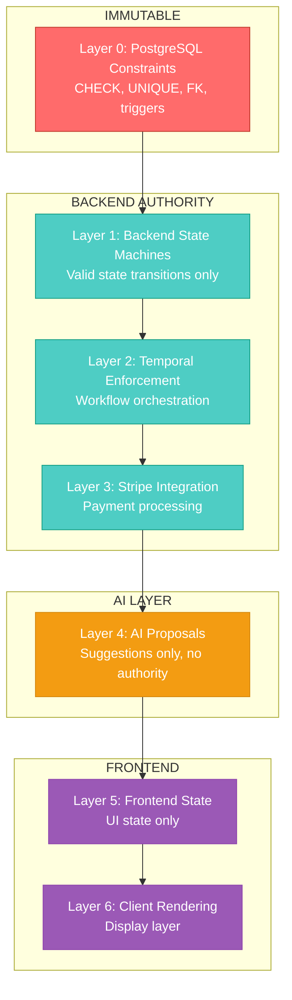
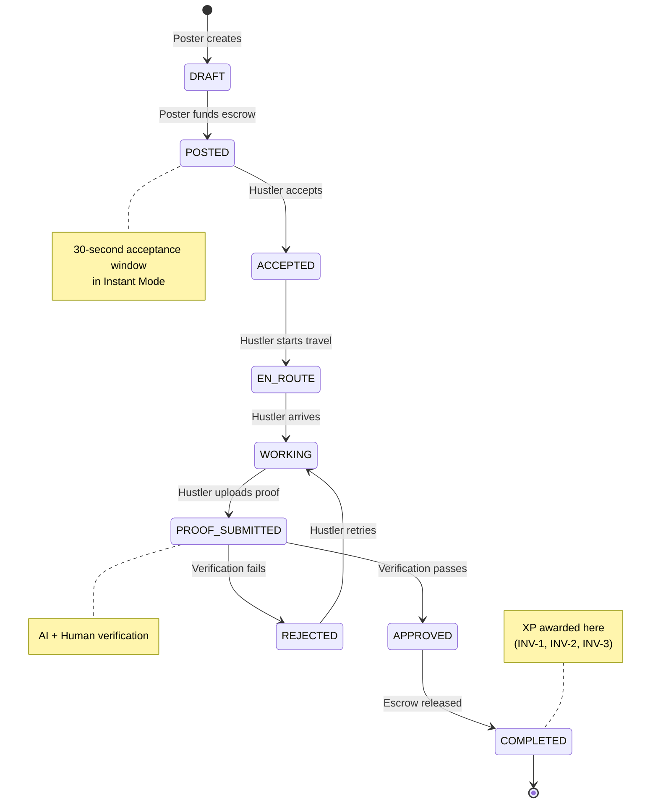
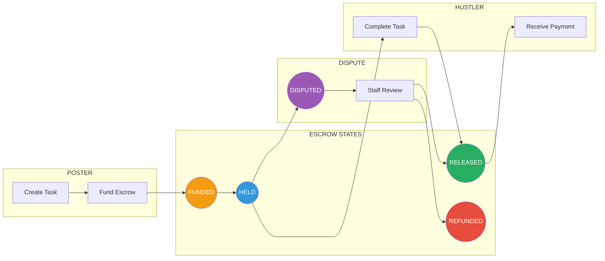
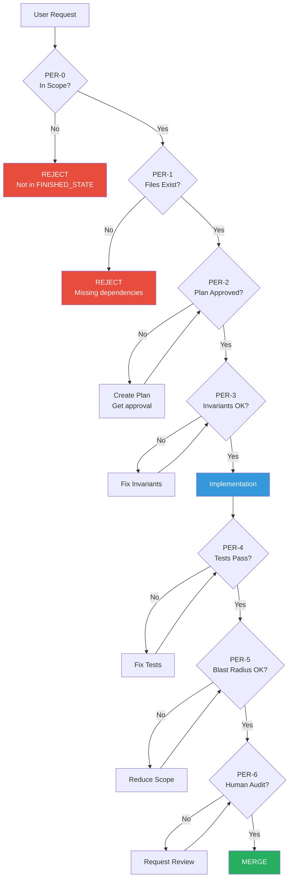
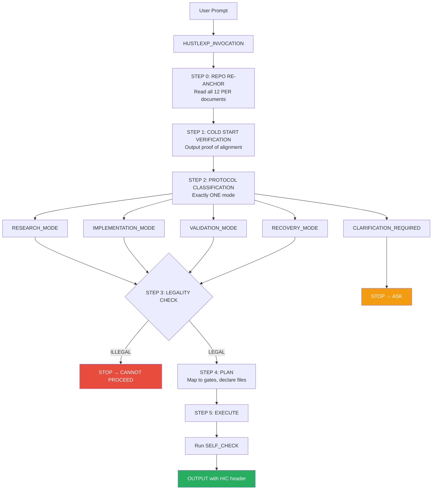
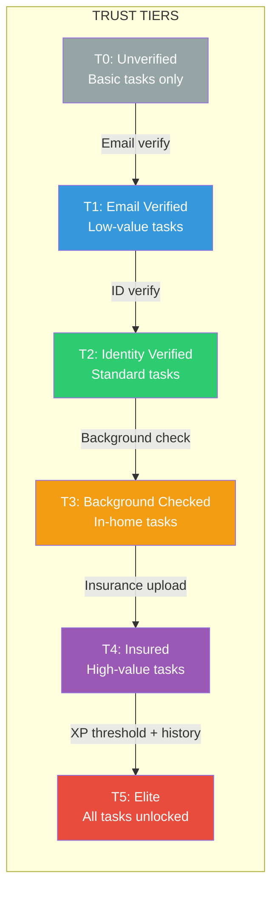
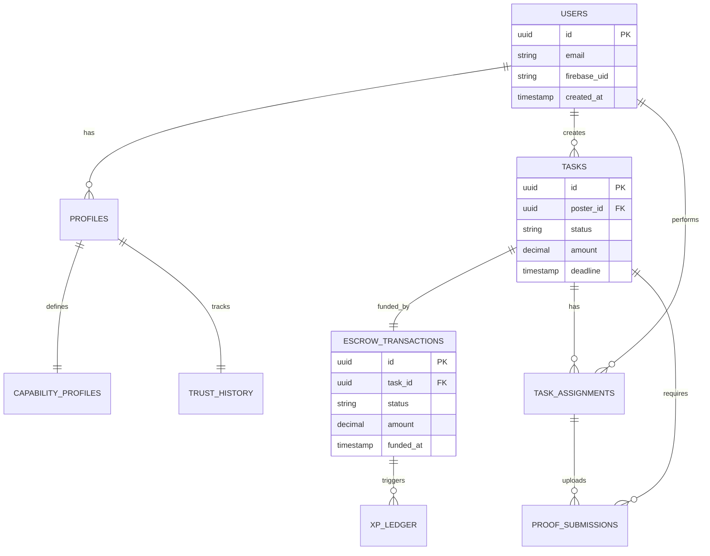
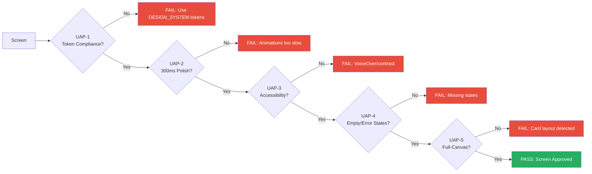
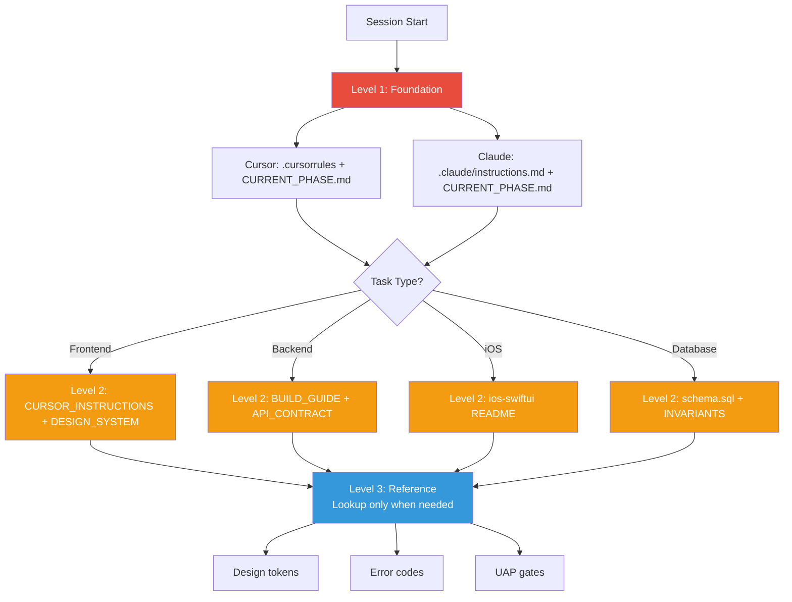

# ARCHITECTURE DIAGRAMS — HUSTLEXP VISUAL REFERENCE

**STATUS: REFERENCE**
**PURPOSE: Visual representations of system architecture using Mermaid**
**LAST UPDATED: 2026-01-24**
**VERSION: 2.0.0**

---

## 1. Authority Hierarchy

The 7-layer authority model determines which system has final say over data.



**Rule:** Higher layers cannot override lower layers. Database is constitutional.

---

## 2. Task Lifecycle State Machine

Every task follows this exact state progression. No shortcuts allowed.



---

## 3. Escrow Flow

Payment lifecycle tied to task completion.



**INV-4:** Escrow amount is immutable after FUNDED state.

---

## 4. PER Enforcement Chain

Every code change must pass through these gates.



---

## 5. HIC Invocation Flow

Every Cursor response follows this mandatory syscall.



---

## 6. Trust Tier Progression

6-level trust system gating task complexity.



---

## 7. XP Award Flow

XP is only awarded after escrow release (INV-1).


---

## 8. Color Semantics Flow

Brand color application follows strict semantic rules.

```mermaid
flowchart TD
    SCREEN[Screen Type?] --> ENTRY{Entry/Welcome?}

    ENTRY -->|Yes| PURPLE[PURPLE ONLY<br/>#5B2DFF gradient]
    ENTRY -->|No| CONTEXT{Context?}

    CONTEXT -->|Success State| GREEN[GREEN<br/>#34C759]
    CONTEXT -->|Error State| RED[RED<br/>#FF3B30]
    CONTEXT -->|Warning State| ORANGE[ORANGE<br/>#FF9500]
    CONTEXT -->|Info State| BLUE[BLUE<br/>#007AFF]
    CONTEXT -->|Default| BLACK[BLACK<br/>#0B0B0F]

    PURPLE --> GRADIENT[Apply Entry Gradient<br/>['#1a0a2e', '#0B0B0F', '#000']]
    GRADIENT --> GLOW[Add Purple Glow<br/>#5B2DFF @ 0.2 opacity]

    style PURPLE fill:#5B2DFF,color:#fff
    style GREEN fill:#34C759,color:#fff
    style RED fill:#FF3B30,color:#fff
    style ORANGE fill:#FF9500,color:#fff
    style BLUE fill:#007AFF,color:#fff
    style BLACK fill:#0B0B0F,color:#fff
```

---

## 9. Database Entity Relationships

Core tables and their relationships.



---

## 10. UAP Gate Chain

UI Acceptance Protocol gates every screen must pass.



---

## 11. Context Loading Levels

Progressive context management for AI tools.



---

## Rendering Note

These diagrams use Mermaid syntax. They render automatically on:
- GitHub (README, markdown files)
- VS Code with Mermaid extension
- Notion (via embed)

To preview locally: Use VS Code "Markdown Preview Enhanced" or similar extension.

---

## Cross-References

- `APP_OVERVIEW.md` — System summary
- `specs/02-architecture/schema.sql` — Full database schema
- `PER/PER_MASTER_INDEX.md` — PER system details
- `PER/INVOCATION_COMMAND.md` — HIC specification
- `PER/UI_ACCEPTANCE_PROTOCOL.md` — UAP gates
- `COLOR_SEMANTICS_LAW.md` — Color rules
