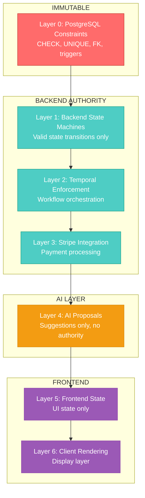
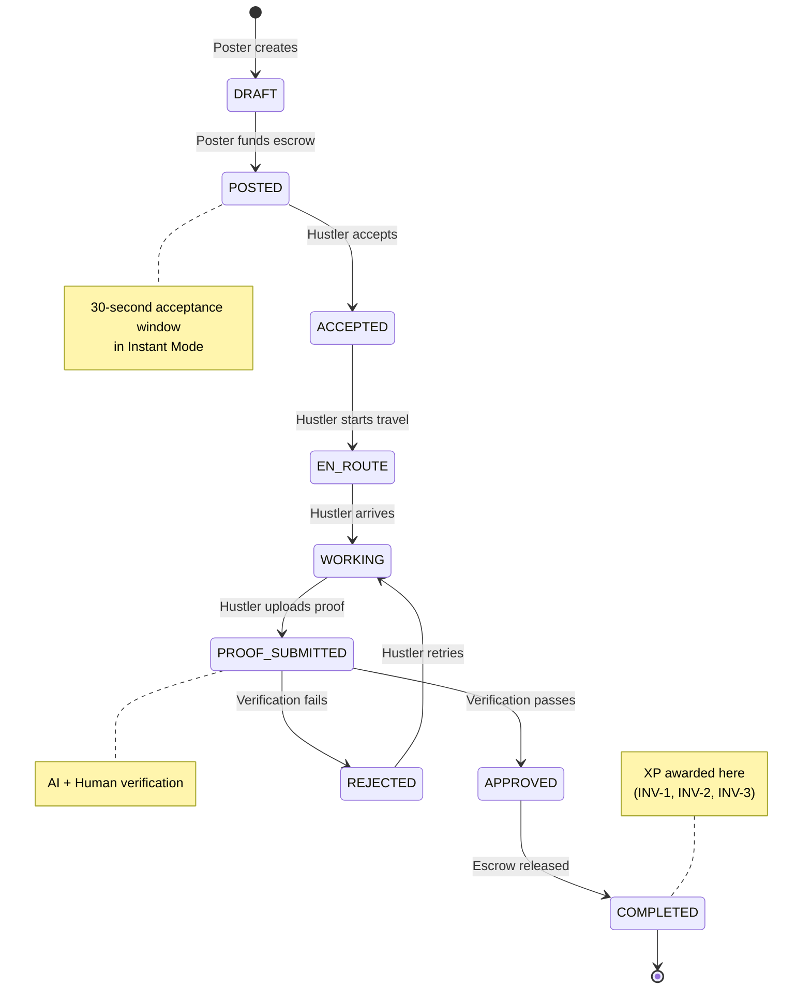
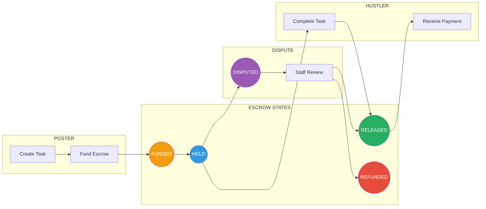
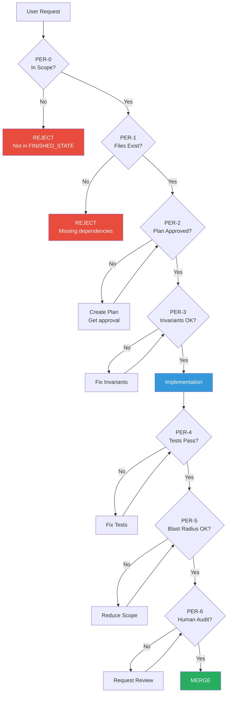
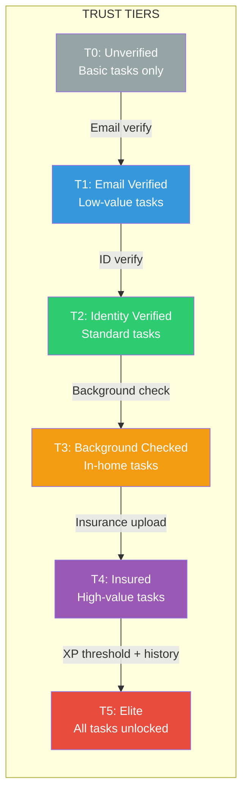
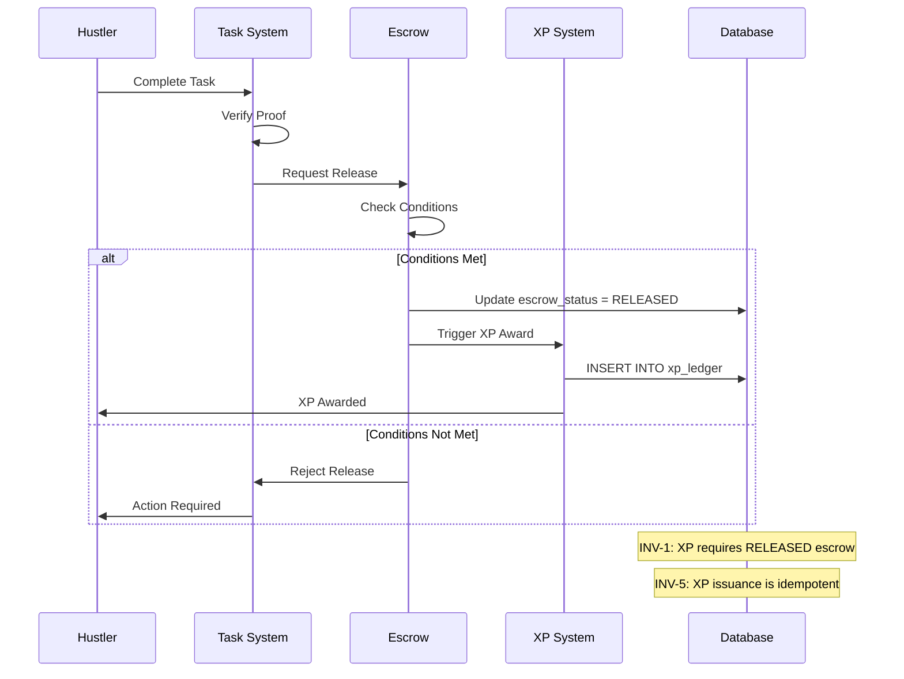
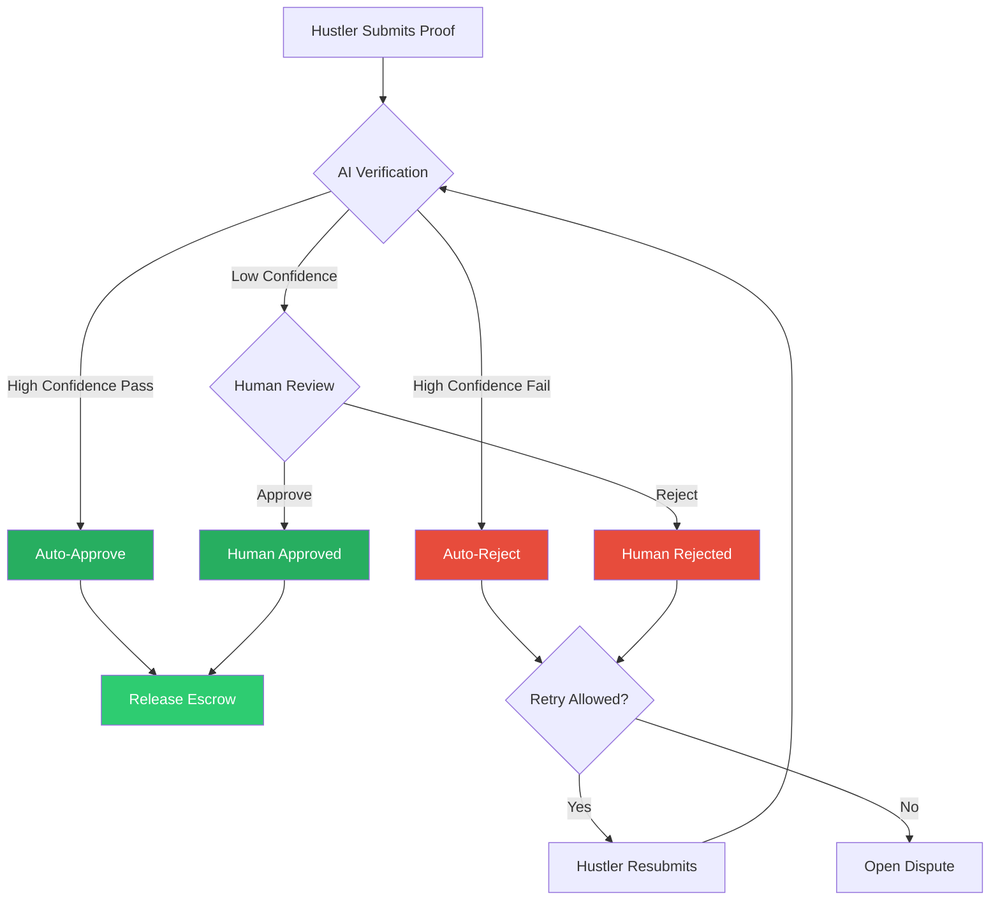
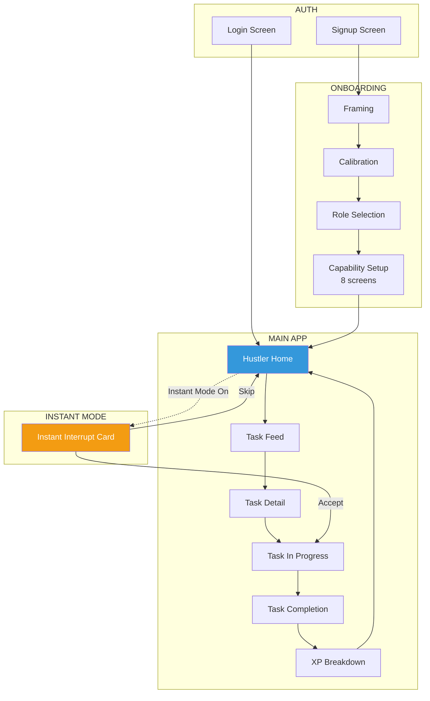
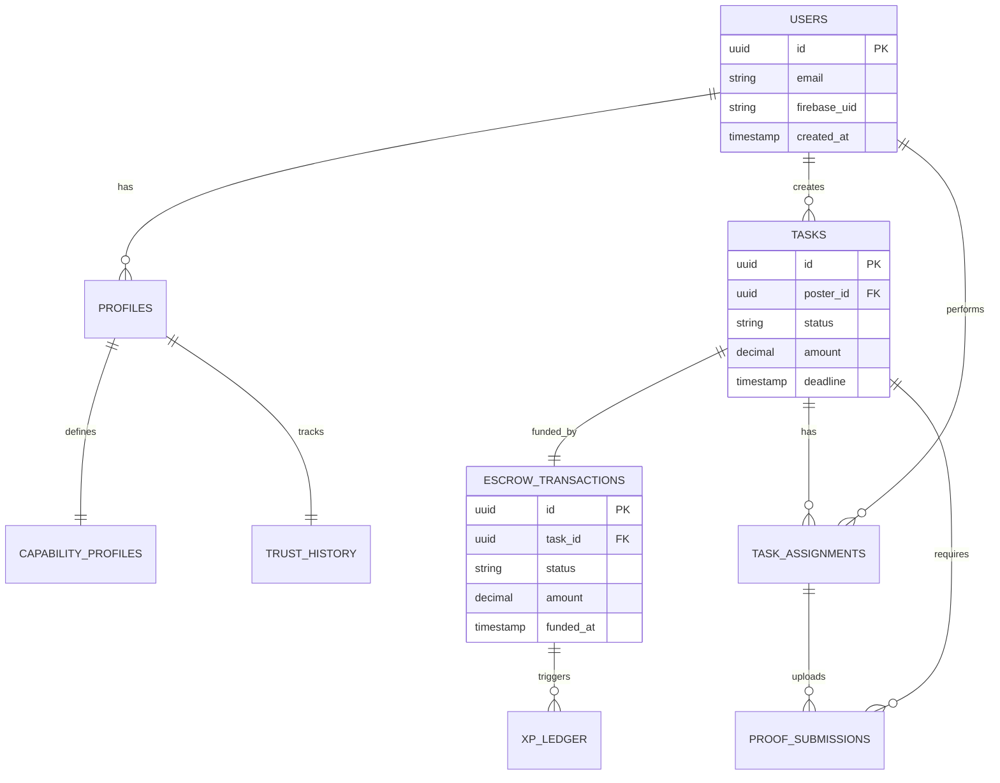
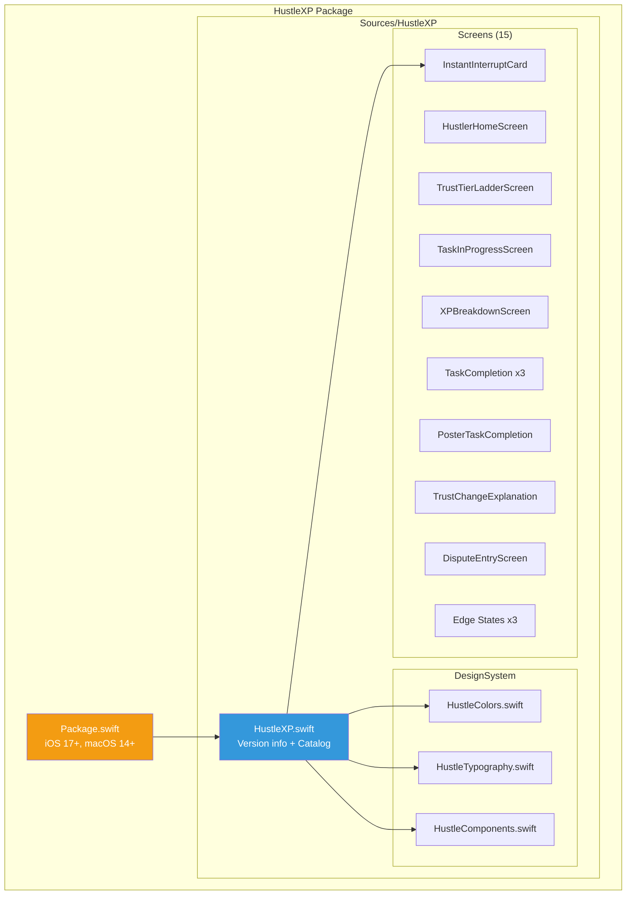

# HustleXP Architecture Diagrams

**Purpose:** Visual representations of system architecture using Mermaid syntax for GitHub rendering.

**Last Updated:** 2025-01-23

---

## 1. Authority Hierarchy

The 7-layer authority model determines which system has final say over data.

**Rule:** Higher layers cannot override lower layers. Database is constitutional.

---

## 2. Task Lifecycle State Machine

Every task follows this exact state progression. No shortcuts allowed.

---

## 3. Escrow Flow

Payment lifecycle tied to task completion.

**INV-4:** Escrow amount is immutable after FUNDED state.

---

## 4. PER Enforcement Chain

Every code change must pass through these gates.

---

## 5. Trust Tier Progression

6-level trust system gating task complexity.

**Each tier unlocks:**
- Higher task values
- More task categories
- Additional capabilities

---

## 6. XP Award Flow

XP is only awarded after escrow release (INV-1).

---

## 7. Proof Verification Flow

Two-stage verification: AI first, human escalation.

---

## 8. Screen Navigation (Hustler Flow)

Main user journey for task workers.

---

## 9. Database Entity Relationships (Simplified)

Core tables and their relationships.

---

## 10. iOS SwiftUI Package Structure

---

## Rendering Note

These diagrams use Mermaid syntax. They render automatically on:
- GitHub (README, markdown files)
- VS Code with Mermaid extension
- Notion (via embed)

To preview locally: Use VS Code "Markdown Preview Enhanced" or similar extension.

---

## Cross-References

- `APP_OVERVIEW.md` — System summary
- `specs/02-architecture/schema.sql` — Full database schema
- `PER/PER_MASTER_INDEX.md` — PER system details
- `screens-spec/SCREEN_REGISTRY.md` — All 38 screens
- `specs/01-product/PRODUCT_SPEC.md` — Full product specification
