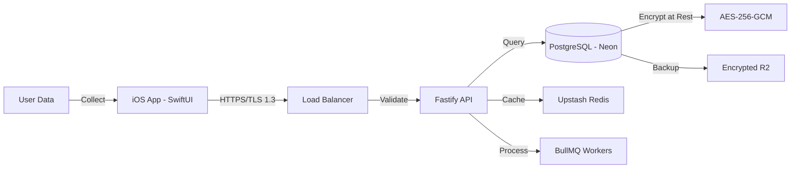

# GDPR IMPLEMENTATION

## Data Flow Architecture



## Article 17 — Right to Erasure ("Right to be Forgotten")

### Implementation
**Service:** `backend/src/services/GDPRService.ts:1-1100`

```typescript
// Erasure workflow
async eraseUserData(userId: string): Promise<ErasureReport> {
  // 1. 30-day cooling period (allows cancellation)
  await this.scheduleErasure(userId, daysFromNow(30));
  
  // 2. Anonymize or delete PII
  await this.anonymizeUserProfile(userId);
  await this.deleteUserMessages(userId);
  await this.deleteUserPhotos(userId);
  
  // 3. Retain financial records (tax requirement)
  await this.retainFinancialRecords(userId);
  
  // 4. Generate confirmation report
  return this.generateErasureReport(userId);
}
```

### Data Categories
| Category | Action | Retention |
|----------|--------|-----------|
| Profile (name, email, phone) | **Delete** | 0 days after request |
| Messages | **Anonymize** | Sender ID → null |
| Task history | **Retain** | Anonymized (7 years tax) |
| Payment records | **Retain** | Original form (7 years tax) |
| Photos/videos | **Delete** | 0 days after request |
| Device tokens | **Delete** | 0 days after request |

### API Endpoint
```
POST /trpc/gdpr.requestErasure
Authorization: Bearer <JWT>
Body: { reason?: string }

Response: {
  erasureId: string,
  scheduledDate: ISO8601,
  status: "scheduled" | "in_progress" | "completed"
}
```

## Article 20 — Data Portability

### Export Format
- **Format:** JSON (machine-readable)
- **Encoding:** UTF-8
- **Compression:** ZIP with password protection

### Export Contents
```json
{
  "exportMetadata": {
    "userId": "uuid",
    "exportedAt": "2026-02-23T10:00:00Z",
    "version": "1.0"
  },
  "profile": { /* user profile data */ },
  "tasks": { /* tasks posted/completed */ },
  "payments": { /* payment history */ },
  "messages": { /* chat history */ },
  "reviews": { /* reviews given/received */ }
}
```

### API Endpoint
```
POST /trpc/gdpr.exportData
Authorization: Bearer <JWT>

Response: {
  downloadUrl: string, // Signed URL, expires in 7 days
  expiresAt: ISO8601
}
```

## Article 33 — Data Breach Notification

### Detection
- Automated anomaly detection (failed auth spikes)
- Manual security team reports
- External vulnerability disclosures

### Timeline
| Action | Deadline | Responsible |
|--------|----------|-------------|
| Detect & assess | 24 hours | Security team |
| Notify supervisory authority | 72 hours | DPO |
| Notify affected users (if high risk) | 72 hours | DPO |
| Public disclosure (if warranted) | Without delay | CEO |

### Notification Content
- Nature of breach
- Categories of data affected
- Approximate number of users
- Likely consequences
- Measures taken
- Contact details for DPO

## Technical Safeguards

### Encryption
| Layer | Algorithm | Key Management |
|-------|-----------|----------------|
| At Rest | AES-256-GCM | Neon managed encryption |
| In Transit | TLS 1.3 | Let's Encrypt |
| Database | pgcrypto | PostgreSQL native |

### Access Controls
- Row-level security (RLS) in PostgreSQL
- JWT-based authentication (Firebase)
- Role-based access control (RBAC)
- Audit logging for all data access

### Data Minimization
- Collect only necessary data
- Automatic purging of logs after 90 days
- Session data expires after 24 hours

## Compliance Contacts
- **Data Protection Officer (DPO):** dpo@hustlexp.com
- **Security incidents:** security@hustlexp.com
- **Data requests:** privacy@hustlexp.com

---
*Last updated: 2026-02-23*
*Document version: 1.0*
*GDPR Compliance Level: Article 17, 20, 33 implemented*
